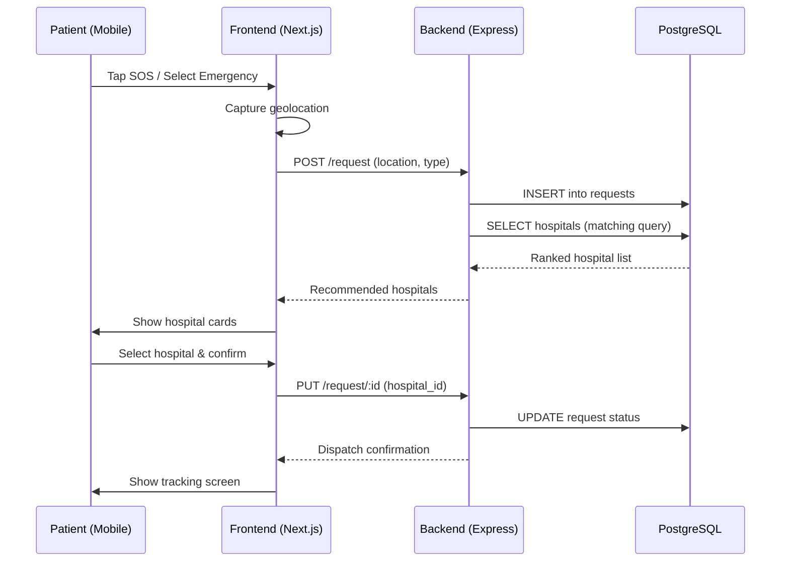
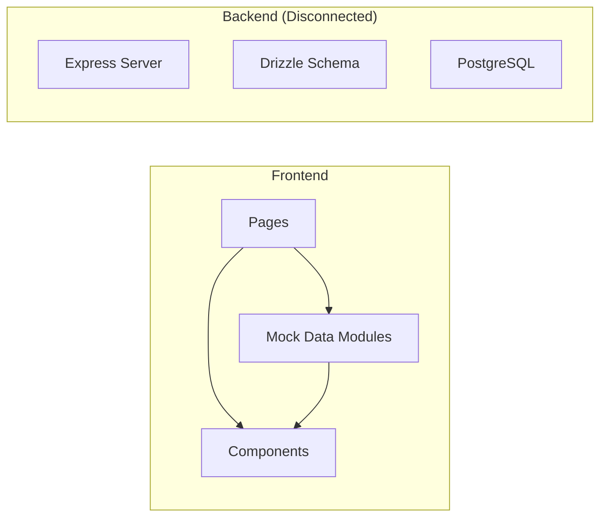
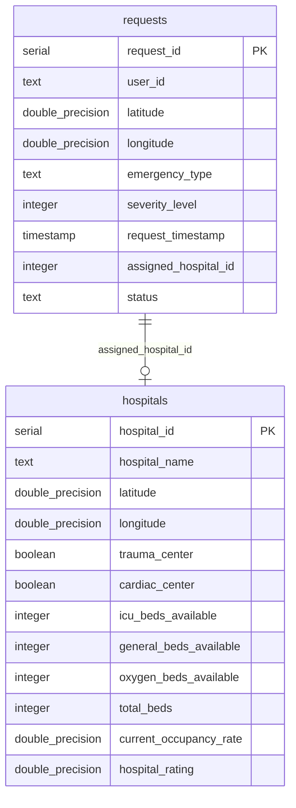
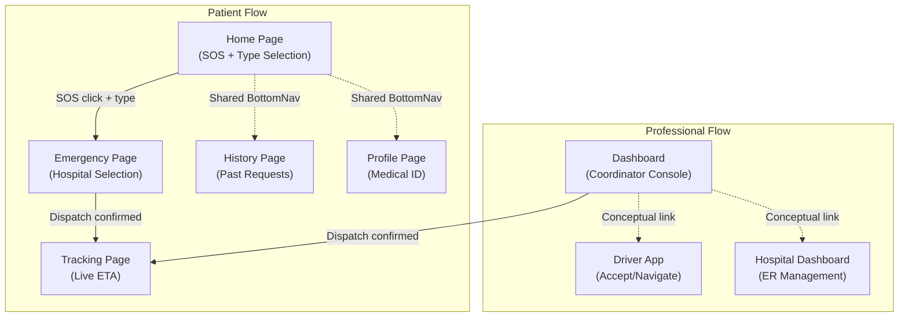
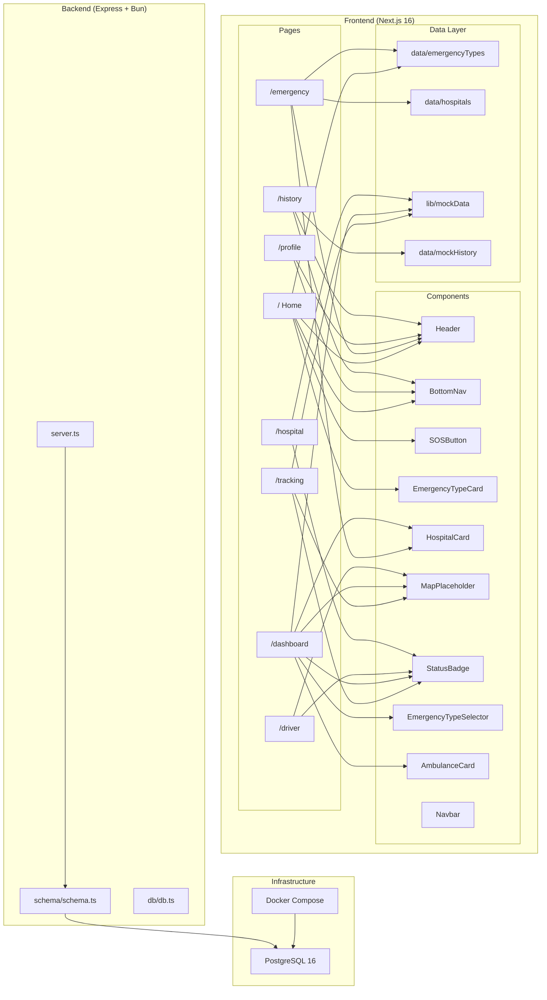
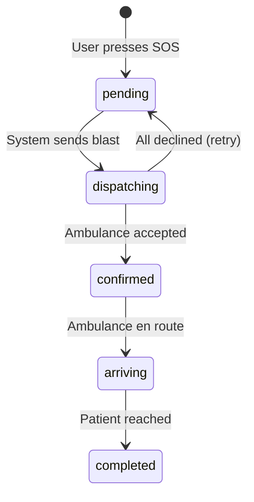

# SavePulse — Complete Codebase Knowledge Document

> **Generated**: 2026-03-07  
> **Repository**: `Savepulse-new`  
> **Purpose**: Emergency ambulance dispatch platform with intelligent hospital matching  

---

## Table of Contents

1. [High-Level Overview](#1-high-level-overview)
2. [System Architecture](#2-system-architecture)
3. [Directory Structure](#3-directory-structure)
4. [Tech Stack](#4-tech-stack)
5. [Database Schema](#5-database-schema)
6. [Feature-by-Feature Analysis](#6-feature-by-feature-analysis)
7. [Component Reference](#7-component-reference)
8. [Data Layer Reference](#8-data-layer-reference)
9. [Cross-Feature Interaction Map](#9-cross-feature-interaction-map)
10. [Nuances, Gotchas & Design Decisions](#10-nuances-gotchas--design-decisions)
11. [Glossary](#11-glossary)
12. [Architecture Diagrams](#12-architecture-diagrams)

---

## 1. High-Level Overview

### What SavePulse Is

SavePulse is a **full-stack emergency ambulance dispatch platform** designed to connect three groups of users:

| Role | Interface | Purpose |
|------|-----------|---------|
| **Patient** | Mobile-first SOS UI | Request ambulances, choose emergency type, track arrival |
| **SOS Coordinator** | Desktop dashboard | Triage emergencies, select hospitals, dispatch ambulances |
| **Ambulance Driver** | Driver app | Receive incoming requests, accept/decline, navigate |
| **Hospital ER Staff** | Hospital dashboard | Accept/decline incoming patients, manage bed availability |

### Business Purpose

SavePulse addresses the critical gap in emergency medical response:
- **Intelligent hospital matching**: Recommends hospitals based on emergency type specializations, distance, and availability
- **Parallel dispatch**: Blast dispatch to multiple hospitals/ambulances simultaneously
- **Real-time tracking**: Simulated live tracking of ambulance ETA and status progression
- **Multi-role coordination**: A single platform linking patients → dispatchers → drivers → hospitals

### Current Maturity

The project is in **early development / prototype stage**:
- The frontend is **fully functional** with mock data (no API calls to the backend)
- The backend has the **schema and server scaffolding** but no API routes beyond `/health`
- All data is currently hardcoded in frontend mock data modules
- No authentication, no real geolocation processing, no actual payment integration

---

## 2. System Architecture

### Architecture Type

**Monorepo with two independent services**:

```
Savepulse-new/
├── backend/    → Express.js API server (Bun runtime)
└── frontend/   → Next.js 16 (React 19) web application
```

### High-Level Data Flow (Target Architecture)



### Current Data Flow (Prototype)

Currently, the frontend operates **entirely on mock data**:



---

## 3. Directory Structure

### Root

```
Savepulse-new/
├── .gitignore
├── backend/                    # Express API server
└── frontend/                   # Next.js web application
```

### Backend (`backend/`)

```
backend/
├── .env                        # DATABASE_URL connection string
├── .gitignore
├── README.md
├── bun.lock                    # Bun package lock
├── data/                       # Generated CSV datasets
│   ├── hospitals.csv           # 50 synthetic hospital records
│   └── users.csv               # 200 synthetic user request records
├── db/
│   └── db.ts                   # Drizzle config (duplicate — note in Gotchas)
├── docker-compose.yml          # PostgreSQL 16 provisioning
├── drizzle/
│   ├── 0000_sour_alex_power.sql  # Initial migration SQL
│   └── meta/                   # Drizzle migration metadata
├── drizzle.config.ts           # Drizzle Kit configuration
├── index.ts                    # Entry point: starts Express on port 3000
├── package.json
├── schema/
│   └── schema.ts               # Database schema (hospitals + requests tables)
├── scripts/
│   └── generate_dataset.py     # Python script to generate synthetic CSV data
├── server.ts                   # Express app factory with CORS + health check
└── tsconfig.json
```

### Frontend (`frontend/`)

```
frontend/
├── .gitignore
├── README.md
├── SavePulse_PRD.docx          # Product Requirements Document
├── prd_content.txt             # PRD in text format
├── bun.lock / package-lock.json
├── eslint.config.mjs
├── next.config.ts
├── next-env.d.ts
├── package.json
├── postcss.config.mjs
├── public/                     # Static assets (favicon, etc.)
├── tsconfig.json
└── src/
    ├── app/                    # Next.js App Router pages
    │   ├── page.tsx            # Home / SOS page
    │   ├── layout.tsx          # Root layout (Geist fonts)
    │   ├── globals.css         # Global styles + CSS variables + animations
    │   ├── dashboard/page.tsx  # Coordinator dispatch dashboard
    │   ├── driver/page.tsx     # Ambulance driver interface
    │   ├── emergency/page.tsx  # Hospital selection + dispatch flow
    │   ├── history/page.tsx    # Past emergency request history
    │   ├── hospital/page.tsx   # Hospital ER dashboard
    │   ├── profile/page.tsx    # User medical profile
    │   └── tracking/page.tsx   # Live ambulance tracking
    ├── components/             # Reusable React components
    │   ├── AmbulanceCard.tsx
    │   ├── BottomNav.tsx
    │   ├── EmergencyTypeCard.tsx
    │   ├── EmergencyTypeSelector.tsx
    │   ├── Header.tsx
    │   ├── HospitalCard.tsx
    │   ├── MapPlaceholder.tsx
    │   ├── Navbar.tsx
    │   ├── SOSButton.tsx
    │   └── StatusBadge.tsx
    ├── data/                   # Static mock data (patient-facing)
    │   ├── emergencyTypes.ts
    │   ├── hospitals.ts
    │   └── mockHistory.ts
    └── lib/                    # Shared mock data (dashboard/professional views)
        └── mockData.ts
```

---

## 4. Tech Stack

### Frontend

| Technology | Version | Purpose |
|-----------|---------|---------|
| **Next.js** | 16.1.6 | React framework with App Router |
| **React** | 19.2.3 | UI library |
| **Tailwind CSS** | 4.x | Utility-first CSS (with v4 `@theme inline` syntax) |
| **Geist** | 1.7.0 | Typography (GeistSans + GeistMono variable fonts) |
| **TypeScript** | 5.x | Type-safe development |
| **PostCSS** | — | CSS processing pipeline for Tailwind |

### Backend

| Technology | Version | Purpose |
|-----------|---------|---------|
| **Bun** | latest | JavaScript runtime (replaces Node.js) |
| **Express** | 5.2.1 | HTTP server framework |
| **Drizzle ORM** | 0.45.1 | Type-safe SQL ORM |
| **Drizzle Kit** | 0.31.9 | Schema migration tooling |
| **PostgreSQL** | 16-alpine | Relational database (via Docker) |
| **pg** | 8.20.0 | PostgreSQL client driver |
| **cors** | 2.8.6 | Cross-origin request handling |
| **dotenv** | 17.3.1 | Environment variable management |

### Data Generation

| Technology | Purpose |
|-----------|---------|
| **Python 3** | Script language for `generate_dataset.py` |
| **pandas** | DataFrame operations for CSV generation |
| **Faker** | Synthetic data generation |

---

## 5. Database Schema

### Schema Namespace

All tables live under a custom PostgreSQL schema: **`my_schema`**

### Tables

#### `my_schema.hospitals`

| Column | Type | Constraints | Description |
|--------|------|------------|-------------|
| `hospital_id` | `serial` | PRIMARY KEY | Auto-incrementing ID |
| `hospital_name` | `text` | NOT NULL | Display name |
| `latitude` | `double precision` | NOT NULL | Geographic latitude |
| `longitude` | `double precision` | NOT NULL | Geographic longitude |
| `trauma_center` | `boolean` | DEFAULT false | Has trauma center capability |
| `cardiac_center` | `boolean` | DEFAULT false | Has cardiac center capability |
| `icu_beds_available` | `integer` | DEFAULT 0 | Current ICU beds free |
| `general_beds_available` | `integer` | DEFAULT 0 | Current general beds free |
| `oxygen_beds_available` | `integer` | DEFAULT 0 | Current oxygen-equipped beds free |
| `total_beds` | `integer` | nullable | Total bed capacity |
| `current_occupancy_rate` | `double precision` | nullable | Occupancy rate (0.0–1.0) |
| `hospital_rating` | `double precision` | nullable | Average rating |

#### `my_schema.requests`

| Column | Type | Constraints | Description |
|--------|------|------------|-------------|
| `request_id` | `serial` | PRIMARY KEY | Auto-incrementing ID |
| `user_id` | `text` | NOT NULL | UUID of requesting user |
| `latitude` | `double precision` | NOT NULL | User's latitude at request time |
| `longitude` | `double precision` | NOT NULL | User's longitude at request time |
| `emergency_type` | `text` | NOT NULL | Type of emergency (e.g. "cardiac") |
| `severity_level` | `integer` | nullable | 1-5 severity rating |
| `request_timestamp` | `timestamp` | DEFAULT now() | When request was created |
| `assigned_hospital_id` | `integer` | nullable | FK to matched hospital |
| `status` | `text` | DEFAULT 'pending' | Request lifecycle state |

### ER Diagram



> **Note**: There is no formal `FOREIGN KEY` constraint between `requests.assigned_hospital_id` and `hospitals.hospital_id` in the Drizzle schema definition. This is an implicit relationship.

---

## 6. Feature-by-Feature Analysis

### 6.1 Home / SOS Request Page

**File**: `frontend/src/app/page.tsx`  
**Route**: `/`  
**Role**: Patient  

**Business Purpose**: Entry point for patients to initiate an emergency ambulance request.

**How It Works**:
1. On mount, generates a UUID via `crypto.randomUUID()` and stores it in `localStorage` as `userID`
2. Calls `navigator.geolocation.getCurrentPosition()` to capture latitude/longitude, stored in `localStorage`
3. Displays a hero section branding SavePulse with "detecting location" indicator
4. Shows a large animated **SOS Button** (pulsing red circle)
5. Renders an **Emergency Type Selector** grid (8 types from `emergencyTypes.ts`: cardiac, stroke, trauma, pediatric, maternity, burns, poisoning, other)
6. On SOS click, navigates to `/emergency?type={selectedType}`

**Components Used**: `Header`, `SOSButton`, `EmergencyTypeCard`, `BottomNav`  
**Data Source**: `data/emergencyTypes.ts`

**Key Detail**: The geolocation call runs unconditionally on every render (no `useEffect`), which means it runs on every re-render. This is a bug — see Gotchas section.

---

### 6.2 Emergency / Hospital Selection Page

**File**: `frontend/src/app/emergency/page.tsx`  
**Route**: `/emergency?type={typeId}&location={text}`  
**Role**: Patient  

**Business Purpose**: After pressing SOS, shows recommended hospitals filtered by emergency type and lets the patient dispatch an ambulance.

**How It Works**:
1. Reads `type` and `location` from URL search params
2. Matches emergency type to its specializations via `emergencyTypes.ts`
3. Calls `getRecommendedHospitals(matchingSpecializations)` from `data/hospitals.ts`
4. **Hospital Recommendation Algorithm** (in `getRecommendedHospitals`):
   - Scores each hospital by counting how many of its specializations match the emergency type
   - Sorts by: score descending → distance ascending (tie-breaker)
   - Filters out `full` hospitals unless they have matching specializations
   - Returns top 5
5. Patient selects a hospital → **Confirm Dispatch** screen shows hospital name, address, distance, ETA
6. Patient confirms → **Dispatch Confirmed** screen with animated checkmark, hospital details, ETA, and "Track Your Ambulance" button

**Three-state UI pattern**: List → Confirm → Success

**Components Used**: `Header`, `HospitalCard`  
**Data Source**: `data/hospitals.ts`, `data/emergencyTypes.ts`

---

### 6.3 Professional Dashboard

**File**: `frontend/src/app/dashboard/page.tsx`  
**Route**: `/dashboard`  
**Role**: SOS Coordinator  

**Business Purpose**: A professional dispatch console for SOS coordinators to manage emergency requests with a split-panel layout.

**How It Works**:
1. **Left Panel**:
   - Emergency type selector (4 types: cardiac, trauma, respiratory, maternal — from `lib/mockData.ts`)
   - Tab switcher: Hospitals | Ambulances
   - Hospital tab: Filtered list of hospitals matching selected emergency type, multi-select up to 3
   - Ambulance tab: List of available ambulances with dispatch/skip actions
2. **Right Panel**:
   - SVG map placeholder showing hospitals, patient location, route lines
   - Quick stats grid: Hospitals Matched, Ambulances Ready, Min ETA, Dispatch Mode
3. **Header**: Dispatch button labeled "🚨 Confirm Dispatch (N)" — enabled only when ≥1 hospital selected
4. On dispatch: Navigates to `/tracking` after 1.5s delay

**Key Feature**: **Parallel dispatch** — coordinator can select up to 3 hospitals simultaneously

**Components Used**: `HospitalCard`, `AmbulanceCard`, `EmergencyTypeSelector`, `MapPlaceholder`, `StatusBadge`  
**Data Source**: `lib/mockData.ts`

> **Important**: This page uses a DIFFERENT data module (`lib/mockData.ts`) than the patient-facing pages (`data/hospitals.ts`), with different hospital data, interfaces, and filtering logic. See Gotchas section.

---

### 6.4 Live Ambulance Tracking

**File**: `frontend/src/app/tracking/page.tsx`  
**Route**: `/tracking`  
**Role**: Patient / Coordinator  

**Business Purpose**: Real-time tracking of ambulance dispatch status and ETA after a request has been confirmed.

**How It Works**:
1. **Simulated status progression** through 4 states: `pending` → `dispatching` → `confirmed` → `arriving`
2. Uses `setTimeout` with configured delays: 1500ms → 2500ms → 3000ms
3. **ETA countdown**: After `confirmed`, counts down from 4 minutes at 1-second intervals
4. **Left Panel**: Status timeline with dot indicators (green/red/gray), current status card, driver info (appears after confirmed), payment note (appears at "arriving")
5. **Right Panel**: SVG map with animated route line and ambulance marker

**State machine**: Linear progression only — no backward transitions, no user-triggered state changes on this page.

**Components Used**: `MapPlaceholder`, `StatusBadge`  
**Data Source**: Hardcoded inline constants

---

### 6.5 Ambulance Driver App

**File**: `frontend/src/app/driver/page.tsx`  
**Route**: `/driver`  
**Role**: Driver  

**Business Purpose**: Interface for ambulance drivers to receive, accept, or decline emergency dispatch requests.

**How It Works**:
1. Three states: `idle` → `incoming` → `navigating`
2. **Idle**: Shows "waiting for requests" overlay on map with "Online" status and a "Simulate Incoming Request" button
3. **Incoming**: Full-screen overlay card with emergency details (type, location, distance, ETA, assigned hospital), Accept/Decline buttons
4. **Navigating**: Bottom HUD bar showing next turn, ETA to patient, distance, and emergency type
5. Accept → `navigating` state after 600ms. Decline → back to `idle` after 2000ms

**All data is hardcoded** (single incoming request: Cardiac Arrest, PAT-0041, Connaught Place)

**Components Used**: `MapPlaceholder`, `StatusBadge`  
**Data Source**: Inline `incomingRequest` object

---

### 6.6 Hospital ER Dashboard

**File**: `frontend/src/app/hospital/page.tsx`  
**Route**: `/hospital`  
**Role**: Hospital ER Staff  

**Business Purpose**: Emergency Room dashboard for hospital staff to manage incoming patient dispatch requests and bed availability.

**How It Works**:
1. **Header**: Hospital identity (Apollo Hospitals), bed counter with ±1 controls, ICU toggle switch, status badge
2. **Left Panel — Incoming Requests**: List of dispatch requests with urgency color coding (critical/high/medium), Accept/Decline actions per request
3. **Right Panel — Active Emergencies**: Stats grid (beds, ICU, incoming count, accepted count) + list of accepted patients en route
4. Accept → changes request status to `accepted`, updates counters. Decline → dims card, marks `declined`.

**Components Used**: `StatusBadge`  
**Data Source**: `lib/mockData.ts` (specifically `incomingRequests` and `emergencyTypes` arrays)

---

### 6.7 User Profile / Medical ID

**File**: `frontend/src/app/profile/page.tsx`  
**Route**: `/profile`  
**Role**: Patient  

**Business Purpose**: Displays the user's medical ID card with critical health information that would be shared with emergency responders.

**Content**:
- Medical ID card (name, phone, blood type, DOB, allergy count)
- Allergies list (Penicillin, Latex)
- Medical conditions (Hypertension, Type 2 Diabetes)
- Emergency contacts with click-to-call
- Edit Profile button (non-functional)

**Data Source**: Inline `mockUser` object  
**Components Used**: `Header`, `BottomNav`  
**Note**: This is a **Server Component** (no `"use client"` directive) — the only non-client page.

---

### 6.8 Emergency History

**File**: `frontend/src/app/history/page.tsx`  
**Route**: `/history`  
**Role**: Patient  

**Business Purpose**: Shows the user's past emergency requests with status and details.

**Content**: List of 6 past records with emergency type, hospital, status (Completed/Cancelled/In Progress), date, original ETA.

**Data Source**: `data/mockHistory.ts`  
**Components Used**: `Header`, `BottomNav`  
**Note**: Also a **Server Component**.

---

## 7. Component Reference

### 7.1 Navigation Components

#### `Header` (`components/Header.tsx`)
- **Props**: `title` (default: "SavePulse"), `showBack` (default: false)
- **Behavior**: Sticky header with ambulance emoji, title, optional back button using `router.back()`
- **Styling**: Tailwind CSS classes, glass-morphism backdrop blur
- **Used on**: Home, Emergency, History, Profile pages (patient-facing)

#### `BottomNav` (`components/BottomNav.tsx`)
- **Nav items**: Home `/`, SOS `/emergency`, History `/history`, Profile `/profile`
- **Behavior**: Fixed bottom bar with active state highlighting. SOS button has special center styling (red bg).
- **Used on**: Home, History, Profile pages (patient-facing mobile layout)

#### `Navbar` (`components/Navbar.tsx`)
- **Nav links**: Emergency `/`, Dashboard `/dashboard`, Tracking `/tracking`, Driver App `/driver`, Hospital `/hospital`
- **Behavior**: Desktop top navbar with role labels (Patient, SOS Pro, Driver, Hospital), live indicator dot
- **Styling**: Inline CSS with CSS custom properties (`--sp-*` namespace)
- **Used on**: Intended for dashboard/professional views (appears not currently wired into any page layout)

### 7.2 SOS & Emergency Components

#### `SOSButton` (`components/SOSButton.tsx`)
- **Props**: `onClick`, `label` (default: "Request Ambulance")
- **Behavior**: Large 144px circular red button with animated ping ring and custom `sos-button-pulse` CSS animation
- **Used on**: Home page

#### `EmergencyTypeCard` (`components/EmergencyTypeCard.tsx`)
- **Props**: `emoji`, `title`, `description`, `selected`, `onClick`
- **Behavior**: Selectable card with red border highlight when selected
- **Used on**: Home page (patient-facing, 8 types)

#### `EmergencyTypeSelector` (`components/EmergencyTypeSelector.tsx`)
- **Props**: `selected: EmergencyType`, `onSelect`
- **Behavior**: 2x2 grid of selectable emergency types with color-coded borders and pulsing dot
- **Data Source**: `lib/mockData.ts` (4 types only: cardiac, trauma, respiratory, maternal)
- **Used on**: Dashboard page (coordinator-facing)

### 7.3 Hospital & Ambulance Cards

#### `HospitalCard` (`components/HospitalCard.tsx`)
- **Props**: `name`, `distance`, `specializations`, `availability`, `etaMinutes`, `onSelect`
- **Behavior**: Card showing hospital details, specialization badges (max 3), availability status, "Select & Dispatch" button (disabled when `full`)
- **Used on**: Emergency page

#### `AmbulanceCard` (`components/AmbulanceCard.tsx`)
- **Props**: `ambulance: Ambulance`, `onAccept`, `onDecline`, `showActions`
- **Behavior**: Card with driver name, vehicle number, vehicle type badge (ALS/BLS/MICU with color coding), mini stats (ETA, distance, rating), dispatch/skip actions
- **Inline helper**: `MiniStat` sub-component
- **Used on**: Dashboard page

### 7.4 Map & Status Components

#### `MapPlaceholder` (`components/MapPlaceholder.tsx`)
- **Props**: `showRoute`, `showAmbulance`, `ambulanceEta`, `label`
- **Behavior**: SVG-based map simulation (800×500 viewBox) with:
  - Grid lines, road lines with dashed center lines
  - Fixed positions for patient, 2 hospitals, ambulance
  - Animated route line (ambulance → patient) when `showRoute=true`
  - Pulsing patient dot, animated ambulance marker
  - ETA callout overlay, location label, zoom control placeholders
  - Dark vignette overlay for visual polish
- **Used on**: Dashboard, Tracking, Driver pages

#### `StatusBadge` (`components/StatusBadge.tsx`)
- **Props**: `status: AvailabilityStatus` ("available" | "busy" | "full")
- **Behavior**: Small colored badge with dot and label
- **Important**: This component has **two different interfaces** — see Gotchas section
- **Used on**: HospitalCard (via Tailwind), Dashboard/Tracking/Driver/Hospital pages (via inline styles)

---

## 8. Data Layer Reference

### 8.1 Patient-Facing Data (`data/`)

#### `data/emergencyTypes.ts`
- **Exports**: `EmergencyType` interface, `emergencyTypes` array (8 items)
- **Fields**: `id`, `emoji`, `name`, `description`, `matchingSpecializations`
- **Emergency Types**: cardiac, stroke, trauma, pediatric, maternity, burns, poisoning, other
- **Used by**: Home page, Emergency page

#### `data/hospitals.ts`
- **Exports**: `AvailabilityStatus` type, `Hospital` interface, `hospitals` array (10 items), `getRecommendedHospitals()` function
- **Hospital Model**: `id`, `name`, `distance`, `distanceKm`, `specializations[]`, `availability`, `etaMinutes`, `address`, `phone`
- **Recommendation Algorithm**: Score by specialization match count → sort by score desc then distance asc → filter out full (unless matched) → limit 5
- **Used by**: Emergency page, HospitalCard, StatusBadge

#### `data/mockHistory.ts`
- **Exports**: `RequestStatus` type, `HistoryRecord` interface, `mockHistory` array (6 items)
- **Used by**: History page

### 8.2 Professional-Facing Data (`lib/`)

#### `lib/mockData.ts`
- **Exports**: Types (`EmergencyType`, `Availability`, `RequestStatus`, `Hospital`, `Ambulance`, `EmergencyRequest`, `IncomingRequest`), data arrays (`hospitals`, `ambulances`, `incomingRequests`, `emergencyTypes`), utility functions (`filterHospitalsByType`, `vehicleTypeLabel`)
- **Hospital Model** (different from `data/hospitals.ts`): `id`, `name`, `address`, `distance`, `distanceKm`, `erWaitMin`, `traumaLevel`, `bedsAvailable`, `icuAvailable`, `hasCardiacUnit`, `hasTraumaUnit`, `hasRespUnit`, `hasMaternalUnit`, `availability`, `rating`
- **Ambulance Model**: `id`, `driverName`, `vehicleType` (ALS/BLS/MICU), `vehicleNumber`, `etaMin`, `distance`, `isAvailable`, `rating`
- **Emergency Types**: 4 types only (cardiac, trauma, respiratory, maternal) with `color` field
- **Filter Logic**: Boolean field matching per hospital (`hasCardiacUnit`, `hasTraumaUnit`, etc.)
- **Used by**: Dashboard, Hospital, Driver, Tracking pages, AmbulanceCard, EmergencyTypeSelector

### 8.3 Backend Seed Data (`backend/data/`)

- `hospitals.csv` — 50 generated hospital records
- `users.csv` — 200 generated user request records
- Generated by `scripts/generate_dataset.py` using Faker + pandas
- **Geographic scope**: Kolkata area (lat 22.45–22.65, lon 88.25–88.45)
- Not currently used by the frontend

---

## 9. Cross-Feature Interaction Map



### Key Interaction Points

| Interaction | Source → Target | Mechanism |
|------------|----------------|-----------|
| Patient initiates SOS | Home → Emergency | `router.push('/emergency?type=X')` |
| Patient dispatches | Emergency → Tracking | `setConfirmed(true)` (stays on page, shows success) |
| Coordinator dispatches | Dashboard → Tracking | `router.push('/tracking')` after 1.5s |
| Type filtering | Home/Dashboard → hospitals | Different data sources + algorithms |
| Navigation | All patient pages | Shared `BottomNav` component |

### Data Source Split

| Pages | Data Module | Hospital Count | Emergency Types |
|-------|-----------|----------------|-----------------|
| Home, Emergency, History | `data/*` | 10 | 8 |
| Dashboard, Hospital, Tracking, Driver | `lib/mockData.ts` | 5 | 4 |

---

## 10. Nuances, Gotchas & Design Decisions

### ⚠️ Things You MUST Know Before Changing Code

#### 1. Two Separate Data Worlds

There are **TWO incompatible mock data modules** with different interfaces:

| Module | Hospital Interface | Emergency Types | Filtering |
|--------|-------------------|-----------------|-----------|
| `data/hospitals.ts` | `specializations: string[]`, `availability: AvailabilityStatus` | 8 types with `matchingSpecializations` | Score-based specialization matching |
| `lib/mockData.ts` | `hasCardiacUnit: boolean` flags, `availability: Availability` | 4 types with boolean matching | Boolean field matching (`filterHospitalsByType`) |

**Impact**: If you add a new hospital, you must add it in BOTH files if it should appear across all views. The type systems are structurally different.

#### 2. Duplicate Drizzle Config

`backend/db/db.ts` contains a second Drizzle configuration that references `./src/schema.ts` (non-existent path). The actual config used is `backend/drizzle.config.ts` which correctly points to `./schema/schema.ts`. The `db/db.ts` file appears to be orphaned/stale code.

#### 3. `StatusBadge` Has Two Incompatible Interfaces

The `StatusBadge` component in `components/StatusBadge.tsx` accepts `AvailabilityStatus` from `data/hospitals.ts` ("available" | "busy" | "full"). However, the Dashboard, Tracking, and Hospital pages pass values like "active", "idle", "dispatching", "confirmed", "arriving" — which are NOT part of the `AvailabilityStatus` type. These pages import `StatusBadge` but pass incompatible status values that would cause TypeScript errors if strict checking were applied. The component currently renders without crashing because JavaScript doesn't enforce types at runtime, but the label and styling will default to `undefined`.

#### 4. Geolocation Call on Every Render

In `frontend/src/app/page.tsx`, the geolocation request runs directly in the component body (not inside `useEffect`):

```typescript
navigator.geolocation.getCurrentPosition((position) => {
  const lat = position.coords.latitude;
  const lng = position.coords.longitude;
  localStorage.setItem("latitude", JSON.stringify(lat));
  localStorage.setItem("longitude", JSON.stringify(lng));
});
```

This means a new geolocation request is made on **every re-render**. It should be wrapped in `useEffect` with an empty dependency array.

#### 5. User ID Generated on Every Render

Similarly, `const user_id = crypto.randomUUID()` and `localStorage.setItem("userID", user_id)` run on every render, generating a new UUID each time. This means the user gets a new identity on every re-render.

#### 6. No Backend API Routes

The backend only has a single `/health` endpoint. All hospital matching, dispatch logic, and tracking is done entirely in the frontend with mock data. Any feature that requires persistence or real-time data will need API routes to be built.

#### 7. No Authentication

There is no auth system. The `user_id` is a random UUID generated per page render. The hospital, driver, and coordinator dashboards have no role-based access control.

#### 8. Docker Container Name Mismatch

`docker-compose.yml` sets `container_name: chat-postgres` but the project is SavePulse, not a chat application. This is likely a copy-paste artifact.

#### 9. Mixed CSS Approaches

Patient-facing pages (Home, Emergency, Profile, History) use **Tailwind CSS classes**. Professional pages (Dashboard, Tracking, Driver, Hospital) use **inline CSS styles** with CSS custom properties (`--sp-*` namespace). These `--sp-*` variables (like `--sp-border`, `--sp-surface`, `--sp-brand`, `--sp-text-muted`) are referenced but **never defined** in `globals.css` — they must be defined elsewhere or fallback to browser defaults.

#### 10. Frontend/Backend Not Connected

The frontend makes zero API calls. All `fetch()` calls are absent. The `DATABASE_URL` in `.env` is set to `localhost:5432` but the frontend has no reference to any backend URL.

#### 11. Missing Foreign Key Constraint

`requests.assigned_hospital_id` is an integer column that conceptually references `hospitals.hospital_id`, but there is no foreign key constraint defined in the Drizzle schema. This means:
- No cascade behavior
- No referential integrity enforcement
- Orphan records are possible

#### 12. Python Dataset vs TypeScript Schema Mismatch

The Python `generate_dataset.py` generates `severity_level` as text ("CRITICAL", "URGENT", "STABLE") but the DB schema defines it as `integer`. The seed data would fail to insert without transformation.

---

## 11. Glossary

| Term | Definition |
|------|-----------|
| **ALS** | Advanced Life Support — ambulance type with advanced medical equipment |
| **BLS** | Basic Life Support — ambulance type with basic medical equipment |
| **MICU** | Mobile Intensive Care Unit — highest-capability ambulance type |
| **SOS** | Emergency distress signal; the primary action in the app |
| **Dispatch** | The act of sending an ambulance to a patient's location |
| **Parallel Dispatch** | Sending requests to multiple hospitals/ambulances simultaneously |
| **ETA** | Estimated Time of Arrival |
| **ER** | Emergency Room |
| **ICU** | Intensive Care Unit |
| **NICU** | Neonatal Intensive Care Unit |
| **Trauma Level** | Hospital classification (Level 1 = highest capability) |
| **Availability Status** | "available" / "busy" / "full" — hospital capacity state |
| **Request Status** | "pending" → "dispatching" → "confirmed" → "arriving" → "completed" |
| **matchingSpecializations** | Array of hospital capabilities that match an emergency type |
| **`--sp-*` variables** | CSS custom property namespace used in professional dashboard views |
| **Drizzle ORM** | Type-safe TypeScript ORM for PostgreSQL |
| **App Router** | Next.js routing paradigm where pages are defined in the `app/` directory |

---

## 12. Architecture Diagrams

### Full System Component Map



### Page ↔ Component Usage Matrix

| Component | Home | Emergency | Dashboard | Tracking | Driver | Hospital | Profile | History |
|-----------|:----:|:---------:|:---------:|:--------:|:------:|:--------:|:-------:|:-------:|
| Header | ✅ | ✅ | | | | | ✅ | ✅ |
| BottomNav | ✅ | | | | | | ✅ | ✅ |
| SOSButton | ✅ | | | | | | | |
| EmergencyTypeCard | ✅ | | | | | | | |
| EmergencyTypeSelector | | | ✅ | | | | | |
| HospitalCard | | ✅ | ✅ | | | | | |
| AmbulanceCard | | | ✅ | | | | | |
| MapPlaceholder | | | ✅ | ✅ | ✅ | | | |
| StatusBadge | | ✅ | ✅ | ✅ | ✅ | ✅ | | |
| Navbar | | | | | | | | |

### Request Lifecycle State Machine



---

## Appendix A: File Index (Priority Ordered)

| # | Priority | Path | Type | Lines | Notes |
|---|----------|------|------|-------|-------|
| 1 | **HIGH** | `frontend/src/app/page.tsx` | Page | 102 | Main entry point, SOS flow |
| 2 | **HIGH** | `frontend/src/app/emergency/page.tsx` | Page | 228 | Hospital selection + dispatch |
| 3 | **HIGH** | `frontend/src/app/dashboard/page.tsx` | Page | 172 | Coordinator console |
| 4 | **HIGH** | `frontend/src/app/tracking/page.tsx` | Page | 214 | Live tracking simulation |
| 5 | **HIGH** | `frontend/src/lib/mockData.ts` | Data | 279 | Primary mock data (professional) |
| 6 | **HIGH** | `frontend/src/data/hospitals.ts` | Data | 158 | Hospital data + recommendation algo |
| 7 | **HIGH** | `frontend/src/data/emergencyTypes.ts` | Data | 66 | Emergency type definitions |
| 8 | **HIGH** | `backend/schema/schema.ts` | Schema | 51 | Database table definitions |
| 9 | **MED** | `frontend/src/app/hospital/page.tsx` | Page | 294 | Hospital ER dashboard |
| 10 | **MED** | `frontend/src/app/driver/page.tsx` | Page | 272 | Driver app |
| 11 | **MED** | `frontend/src/components/MapPlaceholder.tsx` | Component | 200 | SVG map simulation |
| 12 | **MED** | `frontend/src/components/HospitalCard.tsx` | Component | 79 | Hospital card |
| 13 | **MED** | `frontend/src/components/AmbulanceCard.tsx` | Component | 116 | Ambulance card |
| 14 | **MED** | `frontend/src/components/Navbar.tsx` | Component | 125 | Desktop navigation |
| 15 | **MED** | `frontend/src/app/globals.css` | Styles | 89 | Theme variables + animations |
| 16 | **MED** | `backend/server.ts` | Server | 21 | Express app factory |
| 17 | **MED** | `backend/docker-compose.yml` | Config | 22 | Database provisioning |
| 18 | **LOW** | `frontend/src/app/profile/page.tsx` | Page | 145 | Static profile display |
| 19 | **LOW** | `frontend/src/app/history/page.tsx` | Page | 90 | History list |
| 20 | **LOW** | `frontend/src/components/BottomNav.tsx` | Component | 123 | Mobile bottom nav |
| 21 | **LOW** | `frontend/src/components/Header.tsx` | Component | 52 | Header bar |
| 22 | **LOW** | `frontend/src/components/SOSButton.tsx` | Component | 26 | SOS button |
| 23 | **LOW** | `frontend/src/components/StatusBadge.tsx` | Component | 41 | Status indicator |
| 24 | **LOW** | `frontend/src/data/mockHistory.ts` | Data | 68 | History mock data |
| 25 | **LOW** | `backend/scripts/generate_dataset.py` | Script | 129 | Data generation |

---

## Appendix B: Key Functions & Algorithms

### `getRecommendedHospitals(matchingSpecializations, limit=5)`
- **File**: `frontend/src/data/hospitals.ts`
- **Algorithm**: Scores hospitals by specialization overlap count, sorts by score descending then distance ascending, filters out "full" unless they have any matching specialization, takes top N
- **Complexity**: O(n·m) where n=hospitals, m=specializations

### `filterHospitalsByType(type: EmergencyType)`
- **File**: `frontend/src/lib/mockData.ts`
- **Algorithm**: Simple boolean filter on hospital capability flags (`hasCardiacUnit`, `hasTraumaUnit`, etc.)
- **Complexity**: O(n) where n=hospitals

### Status progression simulation
- **File**: `frontend/src/app/tracking/page.tsx`
- **Flow**: pending(1.5s) → dispatching(2.5s) → confirmed(3s) → arriving
- **ETA countdown**: 4→0 minutes, 1-second intervals, starts at confirmed state

---

*End of SavePulse Codebase Knowledge Document*
